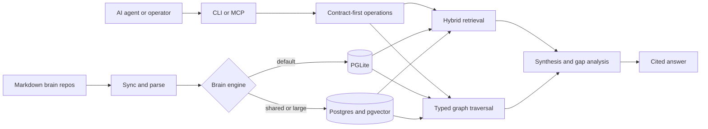

# GBrain

**Search gives you raw pages. GBrain gives you the answer.** It's the brain layer your AI agent has been missing — the only one that does synthesis, graph traversal, and gap analysis in one box. Run a full autonomous agent on top of it, or just wire it into Claude Code or Codex as a supercharged retrieval layer in one command; either way your coding agent stops being amnesiac about everything that isn't code.

I'm Garry Tan, President and CEO of Y Combinator. I built GBrain to run my own AI agents. It's the production brain behind my OpenClaw and Hermes deployments: **155,795 pages, 24,589 people, 5,340 companies**, 66 cron jobs running autonomously. My agent ingests meetings, emails, tweets, voice calls, and original ideas while I sleep. It enriches every person and company it encounters. It fixes its own citations and consolidates memory overnight. I wake up smarter than when I went to bed — and so will you.

**It works as a company brain too.** Each person on the team gets their own slice of the brain, scoped by login. When you query, you only see what you're allowed to see — never another person's notes, never another team's data. We fuzz-tested this across every way you can read the brain (search, list, lookup, multi-source reads) and got zero leaks. Drop GBrain in as your team's shared institutional memory — the [company-brain](https://www.ycombinator.com/rfs#company-brain) shape on YC's Request for Startups. If you're building in that space, you might as well build on this. **[Tutorial: set up GBrain as your company brain →](docs/tutorials/company-brain.md)**

Lots of personal-knowledge systems give you keyword matching and grep in a box. GBrain does that, and adds two things nobody else ships together:

- **A synthesis layer that gives you the actual answer.** Synthesized, well-cited prose across people, companies, deals, and ideas. Not "here are 10 chunks that mention your query"; an actual answer with citations and an explicit note on what the brain doesn't know yet. The gap analysis is the part that changes how you use the brain.
- **A self-wiring knowledge graph.** Every page write extracts entity refs and creates typed edges (`attended`, `works_at`, `invested_in`, `founded`, `advises`) with zero LLM calls. Ask "who works at Acme AI?" or "what did Bob invest in this quarter?" and get answers vector search alone can't reach. Benchmarked: **P@5 49.1%, R@5 97.9%** on a 240-page Opus-generated rich-prose corpus, **+31.4 points P@5** over its graph-disabled variant and over ripgrep-BM25 + vector-only RAG by a similar margin. Full BrainBench scorecards live in the sibling [gbrain-evals](https://github.com/garrytan/gbrain-evals) repo.

The point of building a 150K-page brain is to use it as a strategic moat. To never lose context. To query what's in your own head without re-reading it. The brain layer is what makes the moat usable. The 24/7 dream cycle is what keeps it sharp. Both run on your hardware, your DB, your keys.

It's easier to ship a daemon that runs 24/7 to ingest, enrich, and consolidate than it is to keep an agent in chat working hard. GBrain is that daemon, generalized. Install in 30 minutes. Your agent does the work. As my personal agent gets smarter, so does yours.

> **~15 minutes to a working personal agent** on the recommended Codex / Claude Code path (mostly a short interview); ~30 minutes for the always-on OpenClaw / Hermes setup. Database ready in 2 seconds either way (PGLite, no server).

> **LLMs:** fetch [`llms.txt`](llms.txt) for the documentation map, or [`llms-full.txt`](llms-full.txt) for the same map with core docs inlined in one fetch. **Agents:** start with [`AGENTS.md`](AGENTS.md) (or [`CLAUDE.md`](CLAUDE.md) if you're Claude Code).

## What this looks like

Say you have a meeting with Alice tomorrow. You want to walk in remembering what she works on, when you last talked, and what's still open between you. Here's what you'd type, and what you'd get back.

**You ask:**

> "What do I need to know before my meeting with Alice tomorrow?"

**Most personal-knowledge tools give you back a list of pages.** Something like:

```
1. people/alice — Alice runs engineering at Acme...
2. meetings/2026-03-15-alice-q1 — Q1 product review with Alice...
3. meetings/2026-01-08-acme-kickoff — Kickoff meeting with Acme team...
4. customers/acme — Acme is a series-B fintech we work with...
5. notes/2026-04-22 — Quick chat with Alice about pricing...
```

Five pages you now have to open and read yourself to actually prepare. The tool found the right material, but it didn't do the work.

**GBrain gives you back the answer, with sources:**

```
Alice runs engineering at Acme (a series-B fintech). You last spoke
on April 22 in a quick pricing chat. Three things are still open
from that conversation:

1. She owes you the security review for the new tier
   (deadline was May 1; no update since).
2. You committed to pricing for a 500-seat tier
   (you sent it April 25; no response yet).
3. She mentioned they're hiring a CISO; you said you'd intro
   someone from your network.

Heads up: nothing's been added to the brain about Alice or Acme
since April 22, six weeks ago. She may have replied through email
or Slack DM, channels the brain doesn't see. Worth asking her to
catch up before assuming any of this is still current.
```

Every claim has a source page behind it. The "heads up" at the end tells you what the brain doesn't know yet, so you can ask Alice about it directly instead of being surprised. The brain just did your meeting prep.

This is the difference between a search engine and a brain. Search finds the pages. The brain reads them for you and writes the answer.

## Install

> [!WARNING]
> **GBrain is NOT distributed on npm.** The npm package named `gbrain` is an unrelated
> package with no connection to this project. Do not run `npm install -g gbrain` or
> `bun add -g gbrain` — you'll get something else, and it can shadow the real binary on
> your PATH. Install and upgrade ONLY via the documented paths below
> (`bun install -g github:garrytan/gbrain`, or `git clone` + `bun install && bun link`).
> If you already ran the npm install by mistake: `npm uninstall -g gbrain` /
> `bun remove -g gbrain`, then reinstall from GitHub. `gbrain doctor` detects a
> shadowing npm install and prints the fix.

GBrain is designed to be installed and operated by an AI agent. **New to GBrain? Start with Codex** — it runs on the ChatGPT subscription you already have, takes ~15 minutes, and deploys nothing. Already living in Claude Code? Its path is identical. Want GBrain running the way it was designed to run — always on, enriching your brain around the clock? That's OpenClaw or Hermes, at real server + API cost. Each path below is complete on its own. (Wiring it up by hand instead? Jump to [CLI standalone](#cli-standalone-no-agent) or the [MCP table](#connect-gbrain-to-your-ai-client-mcp).)

### For Codex — the recommended first step

Turn Codex into your persistent personal agent. (Just want the brain + skills without the full agent? `codex plugin marketplace add garrytan/gbrain@codex-plugin` then `codex plugin add gbrain@gbrain` — see [docs/mcp/CODEX.md](docs/mcp/CODEX.md). The paste block below builds the whole agent.) Works in the **ChatGPT desktop app** (open Codex on a folder) and in the **Codex CLI** (`codex` in a terminal) — same install, same result. Open Codex in a **new, empty folder** (not an existing code project) — that folder becomes your agent's own **private GitHub repo**, which bootstrap creates and privacy-verifies for you. Then paste:

```
Read and follow every step of:
https://raw.githubusercontent.com/garrytan/gbrain/latest-stable/BOOTSTRAP_FOR_AGENTS.md
Goal: set yourself up as my persistent personal agent in this folder, with gbrain
as your memory. Interview me before writing any identity file — never invent
answers. Ask before anything destructive. You are not done until
`gbrain bootstrap verify` exits 0.
```

Codex will ask for command approvals during the install — approving them is the sandbox working as intended. What you get, in about 15 minutes: a short interview (6 required questions) → your agent's identity (SOUL.md, USER.md, MEMORY.md) rendered from your own answers, never invented → a local PGLite brain (2 seconds, no server, no Docker) → MCP wired so every session can search and write memory → a **private** GitHub repo, created and privacy-verified, as your agent's durable body. Works with **zero API keys** — keyword search plus memory your agent writes itself; one optional key upgrades capabilities (OpenAI: semantic search + automatic fact extraction; Voyage: semantic search; Anthropic: fact extraction). Codex reads brain context through its tools each turn (pull-based). The click moment: tell it one small thing to remember, restart Codex, then ask for it back — the answer comes from the brain, not from this chat's context (which the restart cleared). That cross-session round-trip is the whole product; "what's my name / my top jobs?" is answered from your identity files, which is nice but not the same trick.

Two things worth understanding once it's running: **you own the brain** — every memory is a markdown file in that private repo (read it, clone it to a second machine, delete it and the brain is gone) — and **the first skill to run is `cold-start`**: say "fill my brain" and your agent imports your Gmail, calendar, and contacts — via the native connector (`gbrain google setup`, tokens in gbrain's local credential vault, never held by the agent), via [ClawVisor](https://clawvisor.com) (a hosted OAuth gateway), or from offline archives like Google Takeout — one consented step at a time. An empty brain is a database; a filled one is a memory.

> **Prefer to make the repo yourself?** Create a new **empty** private repo **under your own GitHub account** (no README/.gitignore/license), clone it, open the clone in Codex, and paste the same block — bootstrap detects your empty repo and adopts it instead of creating one. The repo must be empty and personal-account-owned; org-owned repos are refused (create one under your account, or let bootstrap make it).

### For Claude Code — turn it into your persistent personal agent

Works in the **desktop app** and in the **CLI** (`claude` in a terminal) — identical harness, identical result. Open Claude Code in a **new, empty folder** (not an existing code project) — that folder becomes your agent's own **private GitHub repo**, created and privacy-verified for you. Then paste the same block:

```
Read and follow every step of:
https://raw.githubusercontent.com/garrytan/gbrain/latest-stable/BOOTSTRAP_FOR_AGENTS.md
Goal: set yourself up as my persistent personal agent in this folder, with gbrain
as your memory. Interview me before writing any identity file — never invent
answers. Ask before anything destructive. You are not done until
`gbrain bootstrap verify` exits 0.
```

Everything from the Codex path applies — interview, identity from your own answers, local brain, private repo, keyless mode — plus Claude Code gets **per-turn context hooks** (on by default, with an opt-out): your brain loads automatically into every prompt, and your work persists to your private repo on a per-turn cadence (debounced ~5 min locally, every turn in a cloud sandbox — this covers the `/exit` case the harness never fires a session-end hook on), with a notice on your next turn if a push ever fails. This works in a **Claude Code cloud session** too, not just on your laptop: verification falls back to pure git protocol when the sandbox blocks the GitHub API, and `gbrain bootstrap cloud-setup-script` prints the environment setup recipe. The click moment: tell it one small thing to remember, restart the session, then ask for it back — a fresh session has no chat context, so the answer can only come from the brain. That cross-session round-trip is the whole product ("what's my name?" is answered from your identity files — nice, but not the same trick). Same two follow-ups as the Codex path: you own the brain (markdown in your private repo), and `cold-start` is the first skill to run — "fill my brain" imports your email, calendar, and contacts (ClawVisor) or offline archives, one consented step at a time. Full contract, security posture, cloud sandboxes, and uninstall: [docs/guides/bootstrap.md](docs/guides/bootstrap.md).

> **Prefer to make the repo yourself?** Create a new **empty** private repo **under your own GitHub account** (no README/.gitignore/license), clone it, open the clone in Claude Code (CLI or the desktop app's open-a-repo flow), and paste the same block — bootstrap adopts your empty repo instead of creating one. The repo must be empty and personal-account-owned; org-owned repos are refused.

### For OpenClaw or Hermes — GBrain as intended, always on

This is GBrain used the way it was designed to be used: a server-hosted agent with 24/7 crons, continuous ingestion, and the overnight dream cycle that enriches your brain while you sleep — your agent works whether your laptop is open or not. It's also the highest-cost path: a deployed server (8GB+ RAM) plus raw API token usage that scales with how hard your agent runs, well beyond a chat subscription. Start here if you want the full experience from day one; start with Codex above if you want to feel it first. If you don't have a platform running yet, both deploy in one click:

- **[OpenClaw](https://github.com/openclaw/openclaw)** — deploy [AlphaClaw on Render](https://render.com/deploy?repo=https://github.com/chrysb/alphaclaw) (one click, 8GB+ RAM)
- **[Hermes](https://github.com/NousResearch/hermes-agent)** — deploy on [Railway](https://github.com/praveen-ks-2001/hermes-agent-template) (one click)

Then paste this into your agent:

```
Retrieve and follow the instructions at:
https://raw.githubusercontent.com/garrytan/gbrain/master/INSTALL_FOR_AGENTS.md
```

The agent installs GBrain, creates the brain, asks for your API keys, loads the 50+ bundled skills, configures the dream cycle, and verifies the install end-to-end. ~30 minutes. You answer questions, it does the work.

> **Never set up an AI agent platform before?** The [personal-brain tutorial](docs/tutorials/personal-brain.md) walks the whole path end-to-end — picking OpenClaw vs Hermes, deploying it, pointing it at INSTALL_FOR_AGENTS.md, getting the API keys, and verifying the first query. Start there if any of the above is new.

### Lighter ways in

**Just want a memory for your coding agent — no identity, no repo.** Spin up a local brain and connect it in two commands — zero server, zero token, zero tunnel. `--surface verbs` gives your agent the seven-verb memory protocol (`recall`, `remember`, `entity`, `synthesize`, `forget`, `context_pack`, `delta` — [MEMORY_VERBS v1](docs/protocol/MEMORY_VERBS_v1.md), frozen + additive-forever) instead of the full tool wall; drop the flag for every operation:

```bash
gbrain init --pglite                                    # 2-second local brain (no Docker)
claude mcp add gbrain -- gbrain serve --surface verbs   # or: codex mcp add gbrain -- gbrain serve --surface verbs
```

If `claude` is not found, install Claude Code first — or use the per-harness blocks in the [protocol doc](docs/protocol/MEMORY_VERBS_v1.md). Heads-up: memories agents save default to brain-wide visibility (every connected agent can recall them); pass `visibility: "private"` for local-only facts.

**Already have a brain on a remote host** (OpenClaw, Hermes, or any `gbrain serve --http`)? Point your laptop agents at it with one command each — `--install` wires it up and smoke-tests the token before handoff:

```bash
gbrain connect https://your-host/mcp --token gbrain_xxx --install               # Claude Code
gbrain connect https://your-host/mcp --token gbrain_xxx --agent codex --install # Codex
```

Onboarding a whole agent harness onto a shared brain? On the brain host, `gbrain agent register <name> --harness claude-code` mints a scoped OAuth client plus a 30-day token and prints the paste-ready wiring block — presets for daily-driver and write-isolated coding agents. The [onboarding decision table](docs/guides/agent-to-gbrain.md#onboarding-paths--the-decision-table) says which path fits.

**Brain-only install into another coding agent** (Cursor, Claude Cowork, or anything that can fetch a URL and run shell commands) — paste the OpenClaw/Hermes block above (`INSTALL_FOR_AGENTS.md`); it installs the brain, skills, and dream cycle without the personal-agent identity layer. Tested with Codex, Claude Code, Claude Cowork, Cursor, and AlphaClaw.

**[→ Full walkthrough: give your coding agent a memory](docs/tutorials/connect-coding-agent.md)** — the memory-only paths end to end, plus the brain-first protocol you paste into `CLAUDE.md` / `AGENTS.md` and the four habits that make it actually change how you work.

### CLI standalone (no agent)

```bash
bun install -g github:garrytan/gbrain
gbrain init --pglite     # 2 seconds; no server, no Docker
gbrain doctor            # verify health
gbrain import ~/notes/   # index your markdown
gbrain query "what themes show up across my notes?"
```

Postgres-at-scale, Supabase, and thin-client setup paths live in [`docs/INSTALL.md`](docs/INSTALL.md).

### Connect GBrain to your AI client (MCP)

GBrain exposes nearly all of its 100+ operations as MCP tools (stdio and HTTP; a handful of local-only ops stay CLI-side) — or exactly the seven memory verbs with `--surface verbs`. The specific snippet depends on which client you use:

- **[Claude Code](docs/mcp/CLAUDE_CODE.md)** — plugin: `/plugin marketplace add garrytan/gbrain` + `/plugin install gbrain@gbrain` (MCP + skills; persona variants `gbrain-coding` / `gbrain-daily` install curated subsets — pick exactly one gbrain plugin). Marketplace-free skills: `gbrain skillpack scaffold --harness claude-code` copies a persona-curated skill set into your user-scope skills dir with a local-edit-respecting update lens. Or local one-liner: `claude mcp add gbrain -- gbrain serve` (zero server, zero tunnel). Remote with just a bearer token: `gbrain connect https://your-host/mcp --token gbrain_xxx` prints a paste-ready block (or `--install` wires it up and smoke-tests the token).
- **[Codex](docs/mcp/CODEX.md)** — plugin (recommended): `codex plugin marketplace add garrytan/gbrain@codex-plugin` + `codex plugin add gbrain@gbrain` installs the MCP server AND the curated skill set. Or connect-only: `gbrain connect https://your-host/mcp --token gbrain_xxx --agent codex` (or `--install`); Codex reads the bearer from `$GBRAIN_REMOTE_TOKEN` at runtime, so the token never lands in Codex config.
- **[Cursor / Windsurf / any stdio MCP client](docs/mcp/CLAUDE_CODE.md)** — same shape, add `{"command": "gbrain", "args": ["serve"]}` to your MCP config.
- **[Hermes](docs/mcp/HERMES.md)** — `printf 'Y\n' | hermes mcp add gbrain --env GBRAIN_HOME=$HOME --connect-timeout 60 --command $(which gbrain) --args serve`. Keep `--args` last, and verify with `hermes mcp test gbrain` (the add exits 0 even on failure).
- **[Grok Build](docs/mcp/GROK.md)** — `grok mcp add gbrain -e "GBRAIN_HOME=$HOME" -- gbrain serve --surface verbs`. The add is lazy (exit 0 without connecting) — verify with `grok mcp doctor gbrain`, which spawns the server and reports `7 tools discovered`. Verified against Grok Build v1.0.4.
- **[opencode](docs/mcp/OPENCODE.md)** (opencode.ai / SST — not OpenClaw) — `opencode mcp add gbrain --env GBRAIN_HOME=$HOME -- gbrain serve --surface verbs`, or let `gbrain bootstrap hooks --harness opencode` write the config for you (opencode is a bootstrap-supported harness — it reads AGENTS.md natively). The add is lazy — verify with `opencode mcp list`, which spawns the server (`✓ gbrain connected`). Remote: `gbrain connect https://your-host/mcp --token gbrain_xxx --agent opencode [--install]` — the config stores only the `{env:GBRAIN_REMOTE_TOKEN}` interpolation. Verified against opencode v1.18.18.
- **[OpenClaw](docs/mcp/OPENCLAW.md)** — the ClawHub bundle plugin registers gbrain automatically (`openclaw.plugin.json` ships in this repo), or add `{"command": "gbrain", "args": ["serve"]}` to `~/.openclaw/config.json`'s `mcpServers`.
- **[Claude Desktop (Cowork)](docs/mcp/CLAUDE_DESKTOP.md)** — Settings → Integrations → add the URL of your HTTP server. Remote only; the local `claude_desktop_config.json` does not work for remote servers.
- **[Claude Cowork (team plan)](docs/mcp/CLAUDE_COWORK.md)** — org Owner adds the connector under Organization Settings → Connectors.
- **[Perplexity Computer](docs/mcp/PERPLEXITY.md)** — `gbrain connect https://your-host/mcp --agent perplexity --oauth --register` mints a least-privilege OAuth client and prints the Issuer/Client ID/Secret to paste into Settings → Connectors (OAuth is the right path for a cloud connector; a bearer token also works for local use). Pro subscription required.
- **[ChatGPT](docs/mcp/CHATGPT.md)** — uses OAuth 2.1 with PKCE (the hard requirement). Register a `chatgpt` client from the admin dashboard with grant type `authorization_code`.

For the HTTP server itself:

```bash
gbrain serve              # stdio MCP (local subprocess; for Claude Code, Cursor, Windsurf)
gbrain serve --http       # HTTP MCP with OAuth 2.1 + admin dashboard at /admin
                          # (required for Claude Desktop, Cowork, Perplexity, ChatGPT)
```

The HTTP server includes DCR-style client registration, scope-gated access (`read` / `write` / `admin`), and rate limiting. Deployment guides (ngrok, Railway, Fly.io) live under [`docs/mcp/`](docs/mcp/).

Running several brains behind one tool catalog? Give each one an identity: `gbrain config set mcp.instructions "Team wiki brain — route product and roadmap questions here"` rides every transport's initialize response under a `Deployment identity:` banner, so a connected agent can tell your brains apart. Restart `gbrain serve` to pick it up; `GBRAIN_MCP_INSTRUCTIONS` in the serve process's environment overrides it for that process, and `gbrain config unset mcp.instructions` returns to the bare contract. **Say to your agent:** *"Tell connected agents which brain this is"* — your agent runs `gbrain config set mcp.instructions "<identity>"`.

## Two ways to query your brain

Raw retrieval (what most personal-knowledge tools ship) and a synthesis layer that gives you an actual answer. They serve different jobs.

```bash
# raw retrieval: top pages by hybrid score, fast, no LLM cost
gbrain search "who's working on AI agents at portfolio companies?"

# brain layer: synthesized answer with citations and gap analysis
gbrain think "who's working on AI agents at portfolio companies?"
```

**`gbrain search`** returns the top retrieved pages, ranked by hybrid scoring (vector + keyword + RRF + source-tier boost + reranker). Use it when you want raw material to skim: agent context windows, citation lookups, finding a specific quote.

**`gbrain think`** runs the same retrieval, then composes a synthesized answer across the results with explicit citations to the source pages AND an honest note on what the brain doesn't know yet. The gap analysis is the differentiator: the answer tells you when a page is stale, when a claim is uncited, when two pages contradict each other, when there's a hole you should fill.

**Say to your agent:** *"What do we know about acme-example?"* — *"Tell me about alice-example before my meeting tomorrow"* — *"Search for who's working on AI agents."* Your agent routes these to the brain automatically; you never type the commands yourself.

**Why it compounds.** Pair the brain layer with `find_trajectory` and you get answers like *"how have the company's metrics changed AND what does the team look like right now AND what did they promise / share AND when did we last meet AND what's the value-add I can offer here"*: well-scored, well-cited, in one shot. That's the strategic moat. That's why building a 150K-page brain is worth the effort.

`gbrain agent run "..."` exposes the same surface to a sub-agent through the Minions queue, with crash-safe two-phase persistence. Same answers, durable.

## How to get data in

One command, local or hosted, synchronous receipt:

```bash
gbrain capture "the thought I want to remember"
gbrain capture --file ./notes/today.md
echo "from a pipe" | gbrain capture --stdin
SLUG=$(gbrain capture "..." --quiet)
```

The page lands in the database and on disk in one move. Default slug `inbox/YYYY-MM-DD-<hash8>` so captures cluster in a predictable triage location. On thin-client installs the verb routes through MCP to the server: same command, same UX.

**Say to your agent:** *"Remember this: ..."* — *"Save this thought to my brain"* — *"Capture this."* And to fill an empty brain from your existing life: *"Fill my brain"* (the cold-start skill walks your email, calendar, contacts, and archives one consented step at a time).

**Ambient memory writeback (opt-in, personal brains).** Stop having to say "remember this": once enabled, your agents save durable facts you state in passing — preferences, decisions, commitments — with provenance, and transient facts (a cold, a trip) expire on their own. Off by default; on a personal brain gbrain asks you once at init/upgrade; company brains are never nudged. **Say to your agent:** *"Turn on ambient memory writeback"* — your agent runs `gbrain config set memory.auto_writeback salient` and `gbrain bootstrap harness --yes`. Full mechanics, privacy posture, and per-harness limitations: [`docs/guides/ambient-writeback.md`](docs/guides/ambient-writeback.md).

For webhook ingestion (Zapier / IFTTT / Apple Shortcuts):

```bash
curl -X POST https://your-brain/ingest \
  -H "Authorization: Bearer $TOKEN" \
  -H "Content-Type: text/markdown" \
  -d "# a thought from a Shortcut"
```

For mobile capture, the inbox folder source picks up anything dropped into
`~/.gbrain/inbox/` from iOS Shortcuts / AirDrop / Drafts / Finder.

Your Gmail, calendar, and contacts sync natively. `gbrain google setup` walks
bring-your-own OAuth end to end (your own free Google Cloud client — you own
the app and the tokens, which live only in a local credential vault), registers
a `--kind google` source, runs a bounded first sync, and ends with the
open-loop engine's killer output:

```bash
gbrain google setup       # connect Gmail/Calendar/Contacts → first sync → first digest
gbrain waiting            # who is waiting on you, what you promised, with receipts
gbrain google calendars   # every calendar the account can read; pass an id to
                          #   `sources add … --calendar-id <id>` to sync a secondary one
gbrain loops mute sender <email>     # stop opening loops for a sender (or `thread <id>`)
gbrain loops unmute sender <email>   # undo it — exact and forward-only
```

**Say to your agent:** *"Who is waiting on me?"* / *"open loops"* (routes to the google-loops skill, which also covers muting a sender — your agent runs `gbrain loops mute sender <email>`, and `gbrain loops unmute sender <email>` to undo it) — *"list the calendars my google account can read"* (your agent runs `gbrain google calendars`).

Setup + troubleshooting: [`docs/guides/google-connect.md`](docs/guides/google-connect.md).
How the open-loop engine decides who's waiting: [`docs/guides/open-loops.md`](docs/guides/open-loops.md).

Your other agents' histories import in one command. `gbrain transcripts ingest`
parses agent session logs (Claude Code, Codex, OpenClaw, Hermes, Grok Build) and extracted
consumer chat exports (ChatGPT / Claude.ai `conversations.json`) into readable
conversation pages with provenance back to the exact session file. Secrets are
scrubbed from message bodies, titles, speakers, and session metadata before
anything is written, embedding is off by default for bulk backfills, and
re-runs are free — unchanged sessions skip on content hash:

```bash
gbrain transcripts ingest                    # discover importable session logs
gbrain transcripts ingest --all              # import everything discovered
gbrain transcripts ingest ~/Downloads/conversations.json  # consumer export (unzip first)
gbrain transcripts ingest --max-bytes 4gb <store>          # oversized store; omit to keep per-format caps
gbrain transcripts status                    # found vs imported, per harness
```

**Say to your agent:** *"Import my conversations from my chatgpt export at ~/Downloads/conversations.json"* — *"Archive my session transcripts"* — and later, *"When did I first discuss agent memory?"* (the archive answers origin questions with dated quotes).

Or connect the account and skip the manual export entirely. `gbrain connectors`
syncs your ChatGPT and Claude conversation history live, using your own browser
session cookie — incrementally (a durable per-provider watermark, plus a
trailing-window gap-heal), through the same redaction + idempotency pipeline, and
optionally on a schedule. Credentials stay on your machine (`~/.gbrain/connectors/*.json`,
0600) and are sent only to the provider's own host:

```bash
gbrain connectors auth chatgpt --cookie -    # paste the Cookie header (stdin keeps it out of argv)
gbrain connectors sync chatgpt --dry-run     # preview, then --limit 5, then --full
gbrain config set connectors.chatgpt.auto_sync true   # opt-in daily auto-sync (+ gbrain autopilot --install)
```

**Say to your agent:** *"Connect my chatgpt account and pull my whole history into the brain"* — *"Connect my claude account"* — *"Keep my conversations synced automatically."* Your agent walks you through the cookie capture, runs the dry-run → sample → full sequence, and sets up the schedule if you opt in.

Full contract, automation lanes, and the Cloudflare caveat: [docs/guides/chat-connectors.md](docs/guides/chat-connectors.md).

(Not to be confused with the **inbound** "Connectors" above — those add gbrain
as an MCP connector *inside* ChatGPT/Claude/Perplexity so those assistants can
search your brain. `gbrain connectors` goes the other way: it pulls your
conversation history *from* those accounts *into* the brain.)

Third-party skillpacks can ship custom ingestion sources (Granola, Linear,
voice, OCR) against the versioned `IngestionSource` contract at
`gbrain/ingestion`. See [`docs/skillpack-anatomy.md`](docs/skillpack-anatomy.md).

## Your brain's shape (schema packs)

Most personal-knowledge tools force one fixed layout: their idea of "notes" + "people" + "tags." Drop a Notion export or your own years-old Obsidian vault on top, and the agent doesn't know what a `Projects/` folder means or whether `Reading/` is people or sources.

**gbrain doesn't have a fixed layout.** It ships with bundled schema packs and lets you author your own when none fit:

- **`gbrain-base-v2`** (default) — 15-type DRY/MECE canonical taxonomy (14 canonical + `note` catch-all): `person`, `company`, `media`, `tweet`, `social-digest`, `analysis`, `atom`, `concept`, `source`, `deal`, `email`, `slack`, `writing`, `project`, `note`. Subtypes/format/origin pushed to frontmatter.
- **`gbrain-base`** (legacy) — the wider 24-type layout. Stays bundled for back-compat; brains on it can upgrade via `gbrain onboard --check --explain` → `gbrain jobs submit unify-types --allow-protected --params '{"target_pack":"gbrain-base-v2","apply":true}'` (omit `"apply":true` for a dry-run preview — that is the default).
- **`gbrain-recommended`** — extends `gbrain-base` with the 13 additional directories from `docs/GBRAIN_RECOMMENDED_SCHEMA.md` (source, place, trip, conversation, personal, civic, project, etc.). Activate with `gbrain schema use gbrain-recommended`.
- **Your own pack** — `gbrain schema detect` clusters your actual filesystem into proposed types, `gbrain schema suggest` runs an LLM pass over them, and `gbrain schema review-candidates --apply` promotes the ones you like. Three commands and the brain knows your shape. Authoring a successor pack (declares `migration_from:` so existing brains can opt in): see [`docs/architecture/pack-upgrade-mechanism.md`](docs/architecture/pack-upgrade-mechanism.md).

```bash
gbrain schema active                # which pack is running, which tier set it
gbrain schema list                  # bundled + installed packs
gbrain schema detect                # propose types matching your filesystem
gbrain schema suggest               # LLM-refined proposals on top of detect
gbrain schema review-candidates     # human gate: promote / rename / ignore
gbrain schema use my-pack           # activate
```

**Say to your agent:** *"My schema isn't matching my notes — propose new types from my corpus"* — *"Add a page type for lab results to my brain's schema."* The schema-author skill runs the detect → suggest → review flow for you.

The active pack threads through every read + write path: `parseMarkdown` infers page type from the pack's path prefixes; `whoknows` scopes expert routing to types declared `expert_routing: true`; `extract_facts` runs only on `extractable: true` types; the search cache folds the pack name + version into its key so cross-pack contamination is structurally impossible. Switch packs and the brain re-interprets itself; switch back and nothing's lost.

Seven-tier resolution chain (per-call flag → env var → per-source DB key → brain-wide DB key → `gbrain.yml` → `~/.gbrain/config.json` → `gbrain-base` default). Full reference + authoring guide: [`docs/architecture/schema-packs.md`](docs/architecture/schema-packs.md).

## Tutorials

Step-by-step walkthroughs for getting the most out of GBrain. Each one takes you from zero to a working outcome, with concrete commands and real numbers.

- [**Set up your personal AI agent + brain from zero**](docs/tutorials/personal-brain.md) — the canonical full-stack install. Two GitHub repos, a Telegram bot, AlphaClaw on Render, OpenClaw + GBrain + Supabase. End-to-end in about 2 hours.
- [**Set up GBrain as your company brain**](docs/tutorials/company-brain.md) — federated, multi-user, OAuth-scoped institutional memory for a 10-50 person team. About 90 minutes end-to-end.
- [**Auto-improve a skill with `gbrain skillopt`**](docs/tutorials/improving-skills-with-skillopt.md) — treat a `SKILL.md` as a trainable parameter. Generate a starter benchmark straight from the skill with `--bootstrap-from-skill` (or write your own), strengthen the judges, then watch the optimizer propose edits and keep only the ones that measurably score higher. ~20 minutes, ~$1 in API calls. Flag + cost + safety reference: [`docs/guides/skillopt.md`](docs/guides/skillopt.md).

More walkthroughs in progress: connecting an existing agent (Claude Code, Cursor, OpenClaw, Hermes) to a GBrain memory layer; setting up GBrain for VC dealflow with founder scorecards and meeting prep; migrating an existing Notion or Obsidian vault; indexing a codebase as a queryable code brain. Full tutorial index: [`docs/tutorials/`](docs/tutorials/).

Want to see a tutorial that isn't here yet? [Open an issue](https://github.com/garrytan/gbrain/issues) describing the workflow you want documented.

## What it does (the loop)

```
  signal   →   search   →   respond   →   write   →   auto-link   →   sync
  (every    (brain-first  (informed     (page +    (typed edges     (cron
  message)  retrieval)    by context)   timeline)  + backlinks)     keeps fresh)
```

- **Signal detector** runs on every message your agent receives. Captures ideas, entity mentions, time-sensitive todos, names, links.
- **Brain-first lookup** before any external API call. The cheapest, fastest, most personal information source you have.
- **Auto-link** fires on every page write. No LLM calls; pure pattern matching on `[[wiki/people/bob]]` style references. New entity → new page stub → graph grows.
- **Cron-driven enrichment** runs while you sleep: dedup people pages, fix citations, score salience, find contradictions, prep tomorrow's tasks.

The whole loop is described in [`docs/architecture/topologies.md`](docs/architecture/topologies.md) with diagrams.

**Say to your agent:** *"Set up autopilot"* (installs the cron that runs the loop) — *"Run dream"* — *"Did the dream cycle run?"*

## Capabilities

**Hybrid search.** Vector (HNSW on pgvector) + BM25 keyword + reciprocal-rank fusion + source-tier boost + intent-aware query rewriting. Three named search modes (`conservative`, `balanced`, `tokenmax`) bundle the cost/quality knobs into a single config key. Live cost/recall comparisons in [`docs/eval/SEARCH_MODE_METHODOLOGY.md`](docs/eval/SEARCH_MODE_METHODOLOGY.md). The install picker default-applies `tokenmax` (it recommends `conservative` for Haiku-class subagent tiers or keyless setups); a brain with `search.mode` unset resolves to `balanced` at query time. The cross-encoder reranker is on in `balanced` and `tokenmax`, off in `conservative` — the default is Voyage `rerank-2.5` on `VOYAGE_API_KEY`; without the key search fails open in fusion order and `gbrain search modes` / `gbrain doctor` say so (ask your agent *"check whether my brain's reranker is actually running"*). Per-query graph signals notice when a top result is a hub for THAT query (adjacency boost), is corroborated across team brains (cross-source boost), or is being crowded out by weak chunks from a chatty session (session demote). Run `gbrain search "<query>" --explain` to see per-stage attribution: base score, every boost that fired, what it multiplied. `gbrain doctor` ships a `graph_signals_coverage` check; `gbrain search stats` shows fire counts and failure breakdowns. Vector retrieval pools the best chunk per page, so a page surfaces on its strongest evidence instead of losing to a neighbor on one weak chunk. Queries that match a page's title phrase or a declared free-text alias (`gbrain reindex --aliases` backfills existing pages) get boosted to the page they name. Every result carries an `evidence` tag (why it matched) and a `create_safety` hint (`exists` / `probable` / `unknown`) so an agent decides whether a page already exists instead of guessing from a raw score. `gbrain search diagnose "<query>" --target <slug>` traces which retrieval layer surfaces (or misses) a page. **Say to your agent:** *"Tune my retrieval"* — *"What search mode am I running?"* — *"Why did this page rank first?"* (your agent runs `gbrain search --explain`).

**Self-wiring knowledge graph.** Every `put_page` extracts entity refs from markdown/wikilinks/typed-link syntax and writes edges with zero LLM calls. Typed edges (`attended`, `works_at`, `invested_in`, `founded`, `advises`, `mentions`, …). Multi-hop traversal via `gbrain graph-query`. The graph is what produces the +31.4 P@5 lift over vector-only RAG. **Say to your agent:** *"Who works at acme-example?"* — *"What's the relationship between fund-a and widget-co?"* — *"What connections does alice-example have?"* **Obsidian-style vaults:** bare `[[note-name]]` wikilinks that point across folders — you wrote `[[struktura]]` but the page lives at `projects/struktura.md` — resolve by basename once you opt in with `gbrain config set link_resolution.global_basename true`. Off by default; `gbrain doctor` tells you how many edges you'd gain before you flip it. See [migrating an Obsidian vault](INSTALL_FOR_AGENTS.md#step-45-wire-the-knowledge-graph).

**Job queue (Minions).** BullMQ-shaped, Postgres-native job queue. Durable subagents (LLM tool loops that survive crashes via two-phase pending→done persistence), shell jobs with audit, child jobs with cascading timeouts, rate leases for outbound providers, attachments via S3/Supabase storage. Opt-in per-job process isolation (`gbrain jobs work --job-isolation process`) runs each claimed job in its own SIGKILL-able child process, so a stuck handler dies for real and a crash takes one job instead of the whole worker; when the worker's DB health probe fails, it names the failing layer (`pool_starved` vs `server_unreachable`) instead of a blanket "DB unreachable". Sizing and rollout guidance in [`docs/guides/minions-deployment.md`](docs/guides/minions-deployment.md); probe-verdict triage in [`docs/guides/queue-operations-runbook.md`](docs/guides/queue-operations-runbook.md). Replaces "spawn subagent as fire-and-forget Promise" with something that recovers from anything. **Say to your agent:** *"Run this as a background task and tell me when it's done"* — *"Submit a gbrain job for the backfill"* — *"What's running in the background?"*

**Non-English brains (FTS language config).** The Postgres full-text search tokenizer is configurable via `GBRAIN_FTS_LANGUAGE`. Defaults to `english`. Set it to any text-search configuration that exists in your Postgres instance:

```bash
export GBRAIN_FTS_LANGUAGE=portuguese     # uses built-in portuguese stemmer
export GBRAIN_FTS_LANGUAGE=spanish        # built-in spanish stemmer
export GBRAIN_FTS_LANGUAGE=pt_br          # custom config (e.g. unaccent + portuguese)
```

List available configs: `psql -c "SELECT cfgname FROM pg_ts_config"`. Both the **query side** (`websearch_to_tsquery`) and the **write side** (the trigger functions that populate `pages.search_vector` and `content_chunks.search_vector`) honor `GBRAIN_FTS_LANGUAGE`. On first install (or upgrade), the `configurable_fts_language` schema migration reads the env var and creates trigger functions in the configured language; subsequent inserts/updates tokenize using that setting. To change language on a brain that has already run the migration, use the dedicated CLI command:

```bash
export GBRAIN_FTS_LANGUAGE=portuguese
gbrain reindex-search-vector --dry-run    # preview row counts
gbrain reindex-search-vector --yes        # recreate triggers + backfill
```

The command is idempotent (re-running with the same language is a no-op for vector content) and uses the same recreate-and-backfill primitives as the migration. For accent-insensitive Portuguese (`pt_br`), see [docs/guides/multi-language-fts.md](docs/guides/multi-language-fts.md) for the `unaccent` + portuguese stemmer recipe. **Say to your agent:** *"Set my brain's search language to Portuguese and reindex."*

**50+ curated skills** (the current list lives in [`skills/manifest.json`](skills/manifest.json)). Routing lives in [`skills/RESOLVER.md`](skills/RESOLVER.md). Covers signal capture, ingest (idea / media / meeting), enrichment, querying, brain ops, citation fixing, daily task management, cron scheduling, reports, voice, soul audit, skill creation, eval framework, and migrations. Skills are markdown files (tool-agnostic), packaged as a single skillpack the installer drops into your agent workspace.

**Say to your agent — the phrasebook.** You never invoke a skill by name; you say what you want and your agent routes it. Every skill declares its trigger phrases in its frontmatter, and [`skills/RESOLVER.md`](skills/RESOLVER.md) is the full human-readable phrasebook — one table of "when you say this, this skill fires." A taste: *"Ingest this PDF"* (media-ingest) — *"What's happening today?"* (briefing) — *"Fill my brain"* (cold-start) — *"Brain health"* / *"check backlinks"* (maintain — either phrase routes there) — *"Is my brain set up right?"* (gbrain-advisor) — *"Did the restart break anything?"* (smoke-test) — *"Run this as a background task"* (minion-orchestrator). If you're ever unsure what to say, ask your agent: *"What can my brain do?"* and have it read the resolver back to you.

**Eval framework.** `gbrain eval longmemeval` runs the public [LongMemEval](https://huggingface.co/datasets/xiaowu0162/longmemeval) benchmark against your hybrid retrieval. Measured 2026-09-02 at gbrain v0.48.2.0 on LongMemEval-S (cleaned Sept-2025 revision, 500 questions, 470 scored after the 30 abstention questions are dropped as the official scorer does), hybrid search mode `balanced` with reranker and autocut pinned off, k=5, single run: strict session-level `recall_all@5` of **93.19%** (438/470), meaning every gold session landed inside the top-5 distinct retrieved sessions, retrieval only, no reader model. The looser any-hit `recall_any@5` was 98.72% and is reported as a diagnostic, not a headline. Per-row receipts live in the sibling [gbrain-evals](https://github.com/garrytan/gbrain-evals) repo. The same run also measured the default path: with the default reranker `voyage:rerank-2.5` on (what `balanced` and `tokenmax` run when `VOYAGE_API_KEY` is set), hybrid scores **95.32%** `recall_all@5` (448/470; any-hit 99.79%; paired against reranker-off hybrid it gains 18 questions and loses 8). One warning from the same run: `tokenmax`'s LLM multi-query expansion is harmful at k=5, 54.89% `recall_all@5` (258/470, paired +3 / -183 vs hybrid), so small-k recall is worse in that mode until variant weighting is fixed. `gbrain eval export` + `gbrain eval replay` capture real queries and replay them against code changes (set `GBRAIN_CONTRIBUTOR_MODE=1`). `gbrain eval cross-modal` cross-checks an output against the task using three different-provider frontier models. `gbrain eval retrieval-quality` runs NamedThingBench, which hard-gates the named-thing retrieval families (title-substring, alias-synonym, generic-to-named, multi-chunk-dilution) so a regression in "find the page this query names" fails CI loudly. `gbrain eval brainbench` runs the cross-harness memory conformance suite: know-to-ask, push precision/recall, write-back fidelity, and cross-session continuity, scored per harness seam (your OpenClaw's production pipeline plus Claude Code and Codex injection contracts) against a committed 141-fixture synthetic corpus — hermetic by default (in-memory PGLite, no keys, seconds), and CI gates every PR against master's committed baseline. Methodology in [`docs/eval/BRAINBENCH.md`](docs/eval/BRAINBENCH.md); search-mode methodology in [`docs/eval/SEARCH_MODE_METHODOLOGY.md`](docs/eval/SEARCH_MODE_METHODOLOGY.md). **Say to your agent:** *"Run a regression check on retrieval"* (your agent runs `gbrain eval brainbench`); *"Run the public LongMemEval benchmark"* (no skill backs this one; your agent runs `gbrain eval longmemeval <longmemeval_s_cleaned.json> --retrieval-only --top-k 5 --by-type --no-trajectory`; that in-repo command is a self-check at the default, reranker on when `VOYAGE_API_KEY` is set, and its `--by-type` summary is any-hit recall. The receipted 93.19% strict number comes from the gbrain-evals runner, `bash eval/runner/longmemeval-batch.sh --adapters hybrid --embedding-model openai:text-embedding-3-large --embedding-dims 1536`, which pins reranker and autocut off).

**How it measures up.** One distinction decides every memory-benchmark comparison: strict `recall_all@5` counts a question only when every gold session lands in the top 5, while loose any-hit counts it when a single one does, and 300 of LongMemEval-S's 470 scored questions need two or more sessions. On the strict metric, on this dataset, gbrain scores 93.19% with the reranker off (v0.48.2.0, 2026-09-02, 470 scored) and 95.32% on the default path with `voyage:rerank-2.5` on (same run, same 470); the k=5 ceiling is 99.4% because 3 questions carry 6 gold sessions. The closest strict comparisons we could find: MemPalace publishes only any-hit (96.6% / 98.4%), but rescoring its committed per-question rankings against the official gold labels gives 85.7% for its raw vector setup and 90.0% with an LLM reranker in the loop (our recomputation, their data); ContextFit publishes an All@5 of 87.45% (411/470) whose rerank layer reads gold labels during the run, so we mark it loosely comparable. The 94 to 96% figures quoted for Mastra, Mem0, MemCog, Supermemory and others are LLM-judged answer accuracy, a different race that scores the reader and judge as much as the memory; gbrain has published no answer-accuracy run yet. Pure vector on the same corpus scored 93.8% (v0.48.0.0 receipt), so the hybrid layer is roughly neutral on this benchmark and earns its keep elsewhere. Full table with sources and our read of each: [gbrain-evals `docs/comparison-systems.md`](https://github.com/garrytan/gbrain-evals/blob/main/docs/comparison-systems.md).

**Brain consistency.** `gbrain eval suspected-contradictions` samples retrieval pairs, layered date pre-filter, query-conditioned LLM judge, persistent cache. Surfaces conflicts between takes + facts the agent has written. Wired into the daily dream cycle. **Say to your agent:** *"Did the dream cycle run — what contradictions did it surface?"* — *"Fact-check what we have on acme-example"* (claim-by-claim live-source verification) — or have your agent run `gbrain eval suspected-contradictions` directly.

**Agent-authored schema.** Your brain has a shape — what page types exist (`person`, `meeting`, `paper`, `case`, `lab-result`), what they link to (`attended`, `authored`, `prescribed-by`), what facts get extracted automatically. The default ships with universal types, but your brain's actual shape is not the default shape. Agents can evolve that shape on your behalf via 14 `gbrain schema` CLI verbs + a batched MCP op (`schema_apply_mutations`, admin scope, NOT localOnly so remote agents reach it over HTTPS). Atomic file locks, audit log with the agent's identity, chunked UPDATE backfill in 1000-row batches that never wedge concurrent writers. The brain stops being a pile of notes and becomes something with structure. **Say to your agent:** *"Add a page type to my schema for case files"* — *"My brain has untyped pages — propose new types from my corpus."* **Why it matters:** [`docs/what-schemas-unlock.md`](docs/what-schemas-unlock.md) — 7 killer use cases (4000 invisible meetings, founder ops brain, research brain, legal brain, team brain, agent-as-co-curator). **5-minute walkthrough:** [`docs/schema-author-tutorial.md`](docs/schema-author-tutorial.md). **Agent skill:** [`skills/schema-author/SKILL.md`](skills/schema-author/SKILL.md).

## Integrations

Data flowing into the brain. Each integration is a recipe — markdown + setup hints — that ships in `recipes/` and is discoverable via `gbrain integrations list`. **Say to your agent:** *"Set up voice calls into my brain"* — *"Wire my email and calendar into the brain"* — your agent reads the recipe and walks the setup with you.

- **Voice**: Phone calls create brain pages via Twilio + OpenAI Realtime (or DIY STT+LLM+TTS). Setup recipe: [`recipes/twilio-voice-brain.md`](recipes/twilio-voice-brain.md).
- **Gmail + Calendar + Contacts (native)**: the google source kind syncs threads, events, and contacts through your own OAuth client and runs the open-loop engine on top (`gbrain waiting`). Setup: [`docs/guides/google-connect.md`](docs/guides/google-connect.md); recipes: [`recipes/email-to-brain.md`](recipes/email-to-brain.md), [`recipes/calendar-to-brain.md`](recipes/calendar-to-brain.md).
- **Email + calendar (webhooks)**: webhook handlers that route to brain signals. [`docs/integrations/meeting-webhooks.md`](docs/integrations/meeting-webhooks.md).
- **Embedding providers**: a dozen providers covered — Voyage (default: `voyage-4` @ 1024d), OpenAI, OpenRouter, Google Gemini, Azure OpenAI, MiniMax, Alibaba DashScope, Zhipu, Ollama (local), llama.cpp llama-server (local), LiteLLM proxy, plus ZeroEntropy (deprecated — hosted API ends 2026-09-04). Pricing matrix + decision tree in [`docs/integrations/embedding-providers.md`](docs/integrations/embedding-providers.md).
- **Rerankers**: Voyage `rerank-2.5` hosted (the default; reranking is on in `balanced` and `tokenmax` modes, same `VOYAGE_API_KEY` as embeddings), ZeroEntropy `zerank-2` (deprecated — hosted API ends 2026-09-04; an explicit config short-circuits past that date), plus the `llama-server-reranker` recipe for fully-local cross-encoder rerank via llama.cpp — runs Qwen3-Reranker or self-hosted zerank weights against the same `gateway.rerank()` seam. Setup walkthrough in [`docs/ai-providers/llama-server-reranker.md`](docs/ai-providers/llama-server-reranker.md).
- **Credential vault + gateway**: `gbrain creds` manages OAuth and API credentials in a local vault ([`recipes/credential-gateway.md`](recipes/credential-gateway.md)); agent-side vault-aware secret distribution: [`docs/integrations/credential-gateway.md`](docs/integrations/credential-gateway.md).
- **MCP clients**: every major MCP client is supported. [`docs/mcp/`](docs/mcp/) per-client setup.
- **Memorable (procedural memory)**: optional, off by default. Your brain remembers *what* happened; Memorable makes your agent remember *how* — finished sessions become replayable procedures stored on your machine (in a standalone local store, or inside your brain database if you opt in), recalled when a similar task comes back. See the section below, and [`docs/memorable-agents.md`](docs/memorable-agents.md) for the agent-facing detail.

### Memorable — remember how, not just what (optional)

The third time your agent fixes the same class of bug, it shouldn't re-diagnose it from scratch. Without procedural memory, every session starts cold: re-explore the codebase, re-find the file, re-discover which command actually verifies the fix. [Memorable](https://www.memorable.sh) closes that loop. Once enabled, a finished session's real tool calls — what ran, with what arguments, and (where the harness records it) whether each step succeeded — become an ordered, replayable *procedure*: steps, trigger signature, preconditions, postconditions. It is stored **on your machine**, in a standalone local store by default or inside your existing brain database if you opt in (the fine print explains the trade-off). Next time a similar task shows up:

```sh
memorable recall "the order-validation tests are failing again"
# → 0.981  procedures/ab12cd34-fix-failing-order-tests  [lexical]
memorable show procedures/ab12cd34-fix-failing-order-tests
# → last time this landed in src/orders/validate.js and
#   ./test.sh verified it — the steps, in order, with real outcomes
```

Your agent skips the diagnosis it already did once and goes straight to the fix. That's the whole product: **capture is automatic** (nothing to remember at the end of a session), and **recall is one command** at the start of the next.

**Say to your agent:** *"Set up Memorable so you remember how tasks were done"* — your agent installs and initializes the CLI (`npm i -g memorable-cli`, `memorable init`, `memorable enable`); you then run the one consent step below yourself. Day to day: *"Before you start, check Memorable for how we did this last time"* — your agent runs `memorable recall "<the task in your words>"` — and *"What has Memorable stored so far?"* — your agent runs `memorable list`.

**Turn it on (three steps, the last one is yours):**

```sh
npm i -g memorable-cli                    # 1. the CLI, published on npm (closed source)
memorable init && memorable enable         # 2. standalone local store + let Memorable record sessions
                                           #    (`memorable init gbrain` stores procedures in your brain DB
                                           #     instead — trade-off in the fine print's first bullet)
gbrain config set integrations.memorable.enabled true   # 3. YOU run this: gbrain shows exactly what
                                                         #    leaves the machine and asks you to approve it
```

Step 3 is mandatory and interactive by design — the relay stays off until you accept gbrain's disclosure prompt. There is no account to create and no embedding model to configure (your gbrain provider is reused if present; otherwise Memorable's server computes the embedding for you). From then on, capture runs itself: Claude Code and Codex sessions are recorded at session end. OpenClaw capture runs per compaction but does not yet yield stored procedures (it records tool names only, which the service rejects as not replayable — details in the fine print).

#### The fine print (read before enabling)

**Provenance, stated plainly:** the `memorable` CLI is a closed-source npm package published by a third party (Memorable, not gbrain), with no public source repository and no build attestation gbrain can verify. Enabling the relay means a third-party binary runs at your session boundaries and sends redacted session data to Memorable's extraction API. gbrain itself never sends anything off-machine for this integration.

**What gbrain verifies vs. what is Memorable's claim** — the split matters:

- *gbrain-verified (enforced by gbrain's own code):*
  - The relay is OFF by default and stays off until you accept gbrain's disclosure prompt (`gbrain config set integrations.memorable.enabled true`). The consent stamp it writes lives in a gbrain-private file the CLI has never written, so the CLI flipping the config flag out-of-band can never activate the relay before you have consented once; gbrain-side disable/unset revokes the stamp and forces a fresh disclosure.
  - Tool-call arguments are secret-scanned with the high-entropy rules before they reach the receipt.
  - The relay process gbrain launches at session end is additionally skipped without positive evidence of Memorable-side consent.
  - `GBRAIN_MEMORABLE=0` (any common negative spelling, trimmed — no env value can enable) kills everything.
  - `gbrain doctor`'s `memorable_relay_health` names every broken or half-consented state.
- *Memorable's claims (from its docs and observable client behavior — gbrain cannot verify the server side):* the extraction API is stateless, raw traces are not kept long-term, only derived "nodes" are stored, and there is no shared graph across users. Note the anonymous `mk_` API key means there is also no account through which to exercise deletion of anything the server did retain.

How it fits gbrain's model:

- **Where procedures live — know the trust shape.** Standalone mode (`memorable init`, the default in the block above) stores procedures in a local store under `~/.memorable` and keeps the CLI out of your brain database entirely — the safer choice for sensitive brains. In gbrain-backend mode (`memorable init gbrain`), procedures become ordinary pages in a dedicated non-federated `memorable` source in the brain you already run; Memorable's *service* never connects to your database, but the closed-source *CLI* then has full local access to the whole brain database (that is how it stores procedures).
- **Recall is mostly local — with one exception.** Lookup is exact + lexical first, then semantic through your own embedding provider. If you have **no** local provider configured and the lexical match misses, the CLI sends the query text (your task description, up to 8 KB) to Memorable's `/v1/embed` — recall is not always free of egress.
- **Per-harness capture.** Claude Code and Codex sessions are captured at session end (Codex via a trust-gated `hooks.json` entry that `gbrain bootstrap` manages); OpenClaw sessions are captured **per compaction** — short sessions that never compact are not captured, and the tail after the last compaction never is. OpenClaw capture currently records tool *names* only (arguments unobserved in its session format so far), and Memorable's API refuses name-only traces as not replayable — expect OpenClaw relays to be rejected until argument capture lands. Any other harness can hand a trace over directly: `memorable ingest trace.json`.
- **The store prunes itself, and you can prune it too.** Re-recording refreshes identical revisions and keeps different approaches side by side; `memorable list` / `memorable prune` manage the store, in every consent mode. Local gbrain-side artifacts (`~/.gbrain/integrations/hooks/session-receipts.jsonl` + `memorable-relay.jsonl`) are size-capped, and a one-line purge removes them (see the docs).
- **On/off is explicit — and the CLI writes gbrain's config.** `memorable enable | disable | setup` flips `integrations.memorable.enabled` in `~/.gbrain/config.json` itself (out-of-band). That flag alone never activates the relay: gbrain's disclosure consent is separate, revoked by `gbrain config set integrations.memorable.enabled false` or `gbrain config unset …`, and re-required whenever the capture surface grows (a new harness lane invalidates old consent by design).

The receipt shape, per-command egress table, troubleshooting, and the full consent model are documented in [`docs/memorable-agents.md`](docs/memorable-agents.md).


## Architecture



**Two engines, one contract.** PGLite (Postgres 17 via WASM, zero-config, default) for personal brains up to ~50K pages. Postgres + pgvector (Supabase or self-hosted) for shared / large / multi-machine deployments. The contract-first `BrainEngine` interface in [`src/core/engine.ts`](src/core/engine.ts) defines the 140+ methods both engines implement; CLI and MCP server are generated from one source.

**Brain repo is the system of record.** Your knowledge lives in a regular git repo (your "brain repo") as markdown files. GBrain syncs the repo into Postgres for retrieval; deletes in git become soft-deletes in DB. You can publish public subsets, share team mounts, run thin-client setups pointing at a colleague's brain server. Topologies in [`docs/architecture/topologies.md`](docs/architecture/topologies.md).

**Two organizational axes (brain ⊥ source).** A *brain* is a database (your personal brain, a team mount you joined). A *source* is a repo inside that brain (wiki, gstack, an essay, a knowledge base). Routing lives in `.gbrain-source` dotfiles and resolves via a documented 6-tier precedence chain. Full diagrams in [`docs/architecture/brains-and-sources.md`](docs/architecture/brains-and-sources.md).

**Why the graph matters.** Vector search returns chunks that are semantically close. The graph returns chunks that are factually connected. Hybrid search pulls from both; auto-linking on every write keeps the graph fresh. Deep dive: [`docs/architecture/RETRIEVAL.md`](docs/architecture/RETRIEVAL.md).

## Troubleshooting

**Say to your agent first:** *"Run a brain health check and fix what you find"* — this routes to the maintain skill, which runs `gbrain doctor` and either auto-fixes or prints the exact repair command; your agent can run the whole loop (*"Get my brain health score to 90"* uses the remediation planner with a cost cap). The sections below are for when you want the manual path.

**PGLite crashes at startup with `RuntimeError: Aborted()` (often right after a macOS upgrade)?** Not a macOS incompatibility — the OS-upgrade reboot killed gbrain mid-write and tore the data dir's WAL. gbrain repairs this automatically on the next command (data preserved, backup kept); if auto-repair is disabled or skipped, run `gbrain pglite-repair --dry-run` to diagnose and `gbrain pglite-repair --yes` to repair in place. Full recovery ladder (repair → rebuild → engine switch) in [`docs/ENGINES.md` — Troubleshooting: startup abort](docs/ENGINES.md#troubleshooting-startup-abort-runtimeerror-aborted) and [`docs/INSTALL.md`](docs/INSTALL.md#pglite-crashes-at-startup-runtimeerror-aborted).

**`gbrain import` fails with `expected N dimensions, not M`?** Run `gbrain doctor`. It will print the exact `gbrain config set ...` or `gbrain migrate embeddings` command to repair the mismatch. You should not need to delete `~/.gbrain`. Fresh `gbrain init --pglite` auto-detects your embedding provider from API keys: set `VOYAGE_API_KEY` (or `OPENAI_API_KEY` / another provider key) in the environment — or in `~/.gbrain/config.json`, which init also reads — before running init, or pass `--embedding-model <provider>:<model>` explicitly. With multiple keys set, init fires an interactive picker (non-TTY auto-picks the Voyage default when its key is present). With no keys at all, init continues keyless (keyword-only search) with a loud notice; add a key later and re-run `gbrain init --force --embedding-model voyage:voyage-4` to enable embeddings, or pass `--no-embedding` up front to make keyless explicit. See [`docs/integrations/embedding-providers.md`](docs/integrations/embedding-providers.md) for the full provider matrix and [`docs/operations/headless-install.md`](docs/operations/headless-install.md) for Docker/CI sequencing.

**`gbrain doctor` warns `default_source_local_path`?** Your `default` source has no `local_path` AND that null pointer is provably breaking write-through (the repo fallback is another source's own working tree, or file-backed default pages have no resolvable root). A null `local_path` on its own is the designed fallback topology and reports ok. The repair is a pointer update, never a file move: `gbrain sources set-path default <path>` prints the prior value before changing it and refuses a path that nests inside or swallows another source's tree (exit 6; `--force` bypasses). **Say to your agent:** *"Run a brain health check and fix what you find"* — the maintain skill runs `gbrain doctor` and applies the printed repair.

**Hourly cron sync keeps timing out on a federated brain?** Switch your
cron to a per-source loop with shell `timeout(1)` doing the OS-level kill
and gbrain self-terminating gracefully half-a-minute earlier:

```bash
gbrain sync --break-lock --all --max-age 1800
for src in $(gbrain sources list --json | jq -r '.[].id'); do
  timeout 600 gbrain sync --source "$src" --timeout 540 || true
done
```

When `--timeout` fires mid-import, `gbrain sync` exits 0 with status
`partial` and `last_commit` UNCHANGED — the next run re-walks the same
diff and `content_hash` short-circuits already-imported files. The
`--max-age 1800` first command self-heals any wedged-but-alive locks
left by a hung previous run, keyed on the lock's last refresh time
(NOT when it was acquired) so healthy long-running holders are safe by
construction. Scope note: the extract + embed phases still run to
completion once started; `--timeout` interrupts the import walk only.

**Dream cycle silently losing wiki links on Supabase?** The engine
self-retries every bulk batch write (`addLinksBatch` /
`addTimelineEntriesBatch` / `upsertChunks`) on Supavisor pooler blips,
with a 12s worst-case wait that covers the full 5-10s circuit-breaker
recovery window. `gbrain doctor` surfaces incidents via the
`batch_retry_health` check (reads the last 24h of
`~/.gbrain/audit/batch-retry-YYYY-Www.jsonl`). To tune for an unusually
slow pooler:

```bash
# Defaults: 3 retries, base 1s, max 10s, decorrelated jitter.
# Override per operator without a release:
export GBRAIN_BULK_MAX_RETRIES=5       # int >= 0; 0 disables retries
export GBRAIN_BULK_RETRY_BASE_MS=2000  # int > 0
export GBRAIN_BULK_RETRY_MAX_MS=15000  # int >= base
```

Bad values surface at `gbrain doctor` startup with a paste-ready fix
(not at first-retry mid-cycle). PGLite-only installs pay zero cost — the
retry wrap is engine-level, but PGLite has no pooler so retries never
fire in practice.

**Dream cycle losing ~150 link rows per run with `'No database
connection: connect() has not been called'` errors in the log?** The
retry layer self-heals on a nulled-out database singleton: a
`reconnect` callback on `withRetry` rebuilds the connection between
attempts, and `PostgresEngine.batchRetry` injects `() => this.reconnect()`
so engine-level batch writes survive a mid-cycle disconnect by something
else in the same process. `gbrain capture` does not trail a
`'No database connection'` stderr line from a background facts:absorb
worker firing after CLI exit, because op dispatch awaits
`getFactsQueue().drainPending({timeout: 1000})` before
`engine.disconnect()`. To find which code path is still calling
disconnect mid-process, run `gbrain doctor --json | jq '.checks[] |
select(.id=="batch_retry_health")'`; the check surfaces the
24h disconnect-call count and the most-recent caller frame from the
`~/.gbrain/audit/db-disconnect-YYYY-Www.jsonl` audit.

**`gbrain brainstorm` returning `judge_failed: true` with 0 scored
ideas?** You are on an outdated build; `gbrain upgrade` is the whole
fix (no config change, no schema migration). Current builds size the
judge's output cap to the idea count instead of truncating mid-JSON
past ~40 ideas, and slash-form model ids (`gbrain brainstorm
--judge-model anthropic/claude-sonnet-4-6 --max-cost 5`) resolve
pricing the same as the colon form instead of failing with
`BudgetExhausted reason=no_pricing`.

**`gbrain reindex --markdown` wiped your auto/dream/signal-detector
tags?** Run `gbrain upgrade`. Tag reconciliation is add-only: re-import
and `reindex --markdown` ADD current frontmatter tags and never delete,
so enrichment tags written to the DB (auto-tag, dream synthesize,
signal-detector) survive a re-chunk. The reindex DB-only fallback also
reconstructs the full markdown (frontmatter + body + timeline) before
re-chunking, so a page with no on-disk source keeps its frontmatter,
title, and timeline instead of getting overwritten with empty
frontmatter. Trade-off: removing a tag from a page's frontmatter does
not remove it from the DB on the next sync (frontmatter-tag removal
needs a provenance column, deferred).

**`gbrain sync` wedges on a large brain (no progress, high CPU)?**
Three tools. First, name the stalling file:

```bash
GBRAIN_SYNC_TRACE=1 gbrain sync --no-pull --no-embed --yes
```

The last `[sync] begin import: <path>` line with no following completion
is the file being processed when the hang hit. Second, if you suspect a
schema-pack `inference.regex` with catastrophic backtracking, complete
the sync with the pack disabled and re-run extraction later:

```bash
gbrain sync --no-schema-pack --no-pull --no-embed --yes
```

`gbrain schema lint` warns on the classic nested-quantifier ReDoS
shapes (`(a+)+`, `(a*)*`, …) in pack regexes, and the runtime caps
inference-regex input length (override via `GBRAIN_MAX_REGEX_INPUT_CHARS`).
Third, on a PGLite brain with a live `gbrain serve` (your agent's MCP
server), `gbrain sync` delegates the run to the serve process over its
local IPC socket — the lock owner does the work, your agent stays up,
and Ctrl-C aborts to a checkpoint the next sync resumes from. Embeds
defer to the serve's background sweep. See
[`docs/architecture/serve-sync-concurrency.md`](docs/architecture/serve-sync-concurrency.md)
for the limits (unsupported flags, `serve --http`) and the full triage.

**`gbrain init --migrate-only` / a schema migration fails on Windows
with `getaddrinfo ENOTFOUND`?** Run `gbrain upgrade`. Schema bring-up
runs its phases in-process rather than spawning a child `gbrain init
--migrate-only` per phase; a spawned child is what dies on
Windows + bun + Supabase pooler with a DNS-resolution failure even
though the parent connects fine, and running in-process removes the
spawn entirely. The grandfather migration runs as a chunked bulk SQL
pass (keyed on the page PK, soft-delete-filtered, source-safe) and
completes in seconds on an 80K-page PGLite brain.

## Docs

- [`docs/INSTALL.md`](docs/INSTALL.md) — every install path, end to end
- [`docs/guides/bootstrap.md`](docs/guides/bootstrap.md) — the persistent-personal-agent bootstrap contract (interview, identity files, hooks, private repo, security posture, uninstall), plus local harness mode (`gbrain bootstrap harness`) for wiring framework-spawned Claude Code/Codex sessions to a running serve
- [`docs/what-schemas-unlock.md`](docs/what-schemas-unlock.md) — why schemas matter: 7 killer use cases, the structural argument for typed page kinds, the agent-co-curates pattern
- [`docs/schema-author-tutorial.md`](docs/schema-author-tutorial.md) — 5-minute walkthrough: fork the bundled pack, add a custom type, backfill existing pages, prove the wiring via `gbrain whoknows`
- [`docs/architecture/`](docs/architecture/) — system design, topologies, retrieval theory
- [`docs/guides/`](docs/guides/) — how-to runbooks (google connect, open loops, sub-agent routing, minion deployment, skill development, brain-first lookup, idea capture, diligence ingestion)
- [`docs/integrations/`](docs/integrations/) — connecting external data sources (voice, email, calendar, embedding providers)
- [`docs/mcp/`](docs/mcp/) — per-client MCP setup (Claude Desktop, Code, Cursor, ChatGPT, Perplexity, Cowork)
- [`docs/eval/`](docs/eval/) — eval framework, metric glossary, methodology
- [`docs/ethos/`](docs/ethos/) — philosophy (thin harness, fat skills, markdown as recipes, origin story)
- [`AGENTS.md`](AGENTS.md) — entry point for non-Claude agents
- [`CLAUDE.md`](CLAUDE.md) — entry point for Claude Code (deep operating context)
- [`CONTRIBUTING.md`](CONTRIBUTING.md) — contributor guide, test discipline, eval-capture mode
- [`SECURITY.md`](SECURITY.md) — install-path trust model, self-update integrity, automated scanning, OAuth threat model, hardening defaults

## Contributing

Run `bun run test` for the fast loop, `bun run verify` for the pre-push gate, `bun run ci:local` to run the full Docker-backed CI stack locally. Detailed test discipline in [`CONTRIBUTING.md`](CONTRIBUTING.md).

Community PRs are batched into release waves rather than merged one-by-one — see the community-PR-wave process in [`docs/RELEASING.md`](docs/RELEASING.md). Contributor attribution stays attached via `Co-Authored-By:` trailers. We credit every accepted contribution in [`CHANGELOG.md`](CHANGELOG.md).

If you find a bug or want a feature: open an issue first. Quick fixes (typo, doc bug, obvious regression) can go straight to a PR. Anything touching schema, retrieval ranking, MCP protocol, or the security boundary needs a design discussion in the issue first.

## License + credit

MIT. I built GBrain to run my OpenClaw and Hermes deployments — the production brain behind my AI agents.

Origin story: [`docs/ethos/ORIGIN.md`](docs/ethos/ORIGIN.md).

Community PR contributors are credited in `CHANGELOG.md` per release. ZeroEntropy ([@zeroentropy](https://zeroentropy.dev)) for the ZeroEntropy embedding + reranker integration. Voyage AI for the asymmetric-encoding recipe template. Ramp Labs for the search quality improvements lineage.
